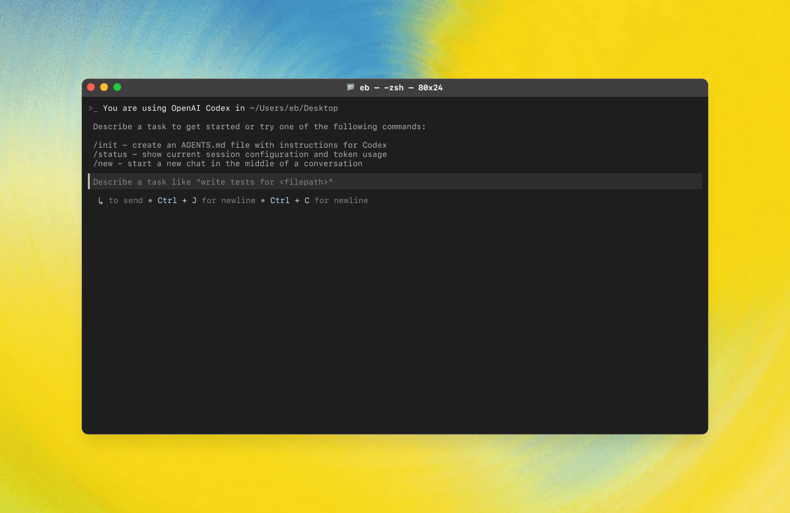

<p align="center"><code>npm i -g @thinwedge/cli</code><br />or <code>brew install never2average/tap/thinwedge</code></p>
<p align="center"><strong>ThinWedge</strong> is an FP&amp;A agent terminal that runs locally on your computer.
<p align="center">
  
</p>
</br>
ThinWedge is published from this repository for GitHub Releases, npm, and Homebrew.</p>

---

## Quickstart

### Installing and running ThinWedge

Install globally with your preferred package manager:

```shell
# Install using npm
npm install -g @thinwedge/cli
```

```shell
# Install using Homebrew
brew install never2average/tap/thinwedge
```

Then simply run `thinwedge` to get started.

<details>
<summary>You can also go to the <a href="https://github.com/never2average/fpna-thinwedge/releases/latest">latest GitHub Release</a> and download the appropriate binary for your platform.</summary>

Each GitHub Release contains many executables, but in practice, you likely want one of these:

- macOS
  - Apple Silicon/arm64: `thinwedge-aarch64-apple-darwin.tar.gz`
  - x86_64 (older Mac hardware): `thinwedge-x86_64-apple-darwin.tar.gz`
- Linux
  - x86_64: `thinwedge-x86_64-unknown-linux-musl.tar.gz`
  - arm64: `thinwedge-aarch64-unknown-linux-musl.tar.gz`

Each archive contains a single entry with the platform baked into the name (e.g., `thinwedge-x86_64-unknown-linux-musl`), so you likely want to rename it to `thinwedge` after extracting it.

</details>

### Using ThinWedge

Run `thinwedge` and configure the API-key-based providers and local agent tooling you want to use.

## Docs

- [**ThinWedge Rust Workspace**](./codex-rs/README.md)
- [**Contributing**](./docs/contributing.md)
- [**Installing & building**](./docs/install.md)
- [**Open source fund**](./docs/open-source-fund.md)

This repository is licensed under the [Apache-2.0 License](LICENSE).
