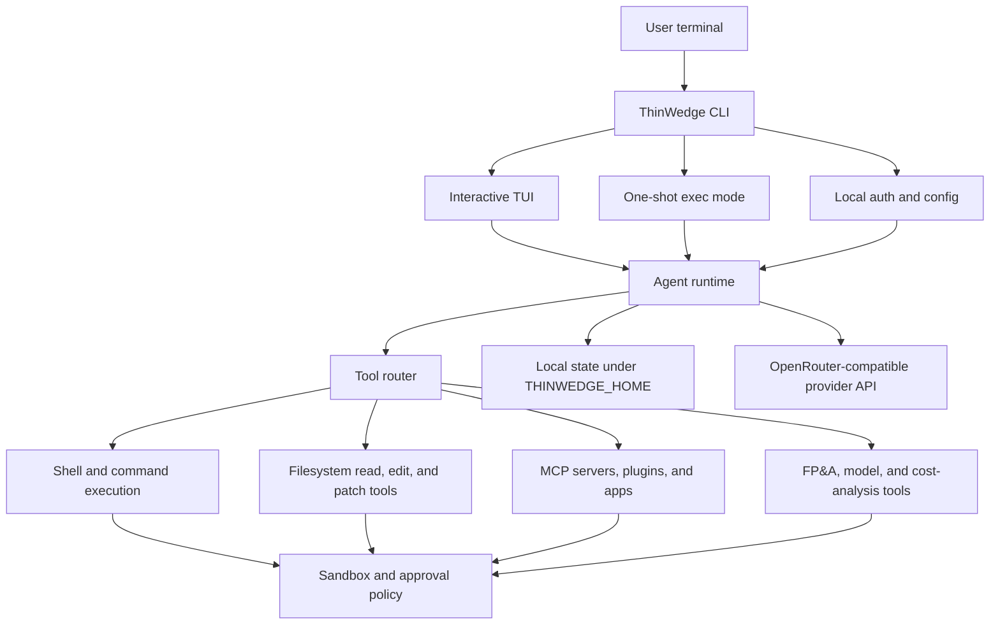

# ThinWedge

ThinWedge is a local FP&A agent terminal for financial modeling, planning analysis,
statistical-model workflows, and cost research. It runs as a terminal UI and CLI on
your machine, keeps workspace state under your ThinWedge home directory, and connects
to provider APIs with an OpenRouter-compatible API token.

## Quick Start

Install ThinWedge globally from npm:

```shell
npm install -g @never2average-does-npm/cli
```

Authenticate before starting interactive mode. In a real terminal, `thinwedge login`
prompts for the required OpenRouter-compatible API token and optional capability
config such as Artificial Analysis, RunPod, AWS profile/region values, and Neon
DB sandbox metadata:

```shell
thinwedge login
# Enter OpenRouter-compatible API key: ...
# ARTIFICIAL_ANALYSIS_API_KEY (...) [optional]: ...
# RUNPOD_API_KEY (...) [optional]: ...
# AWS_PROFILE (...) [optional]: ...
# AWS_REGION (...) [optional]: ...
# THINWEDGE_NEON_API_KEY (...) [optional]: ...
# THINWEDGE_NEON_PROJECT_ID (...) [optional]: ...
```

Or set the provider token in the environment first:

```shell
export OPENROUTER_API_KEY=...
thinwedge login
```

Then start the interactive terminal UI:

```shell
thinwedge
```

Run a one-shot CLI task without opening the TUI:

```shell
thinwedge exec "summarize this repository"
```

Or download a binary from the
[latest GitHub Release](https://github.com/never2average/fpna-thinwedge/releases/latest).

## What It Is

ThinWedge is built for finance and operations teams that need agentic help inside a
real repository or modeling workspace. The agent can inspect and edit files, run shell
commands, maintain plans, manage long-running goals, coordinate side agents, and call
domain tools for statistical modeling, training environments, LLM pricing, and cloud
infrastructure cost analysis.

The product surface is intentionally local-first:

- `thinwedge` starts the interactive terminal UI.
- `thinwedge exec` runs a single non-interactive agent task.
- `thinwedge login` stores an OpenRouter-compatible API token locally.
- `thinwedge db-sandbox` configures and preflights DB sandbox providers.
- `THINWEDGE_HOME` controls where config, auth, logs, thread history, and local state live.

## System Components



## Authentication

ThinWedge uses API-token authentication. Run `thinwedge login` before starting
the interactive TUI so the agent can call the configured provider API. In a real
terminal, `thinwedge login` behaves like an `aws configure`-style prompt: it asks
for the required OpenRouter-compatible API token, then offers optional prompts for
`ARTIFICIAL_ANALYSIS_API_KEY`, `RUNPOD_API_KEY`, `AWS_PROFILE`, `AWS_REGION`,
`THINWEDGE_NEON_API_KEY`, and `THINWEDGE_NEON_PROJECT_ID`.
The required provider token is stored in ThinWedge auth storage; optional capability
values are written to `THINWEDGE_HOME/.env`, which ThinWedge loads on startup.

```shell
thinwedge login
# Enter OpenRouter-compatible API key: ...
# ARTIFICIAL_ANALYSIS_API_KEY (...) [optional]: ...
# RUNPOD_API_KEY (...) [optional]: ...
# AWS_PROFILE (...) [optional]: ...
# AWS_REGION (...) [optional]: ...
# THINWEDGE_NEON_API_KEY (...) [optional]: ...
# THINWEDGE_NEON_PROJECT_ID (...) [optional]: ...
```

You can also provide the provider token through the environment:

```shell
export OPENROUTER_API_KEY=...
thinwedge login
```

You can also pipe a token without leaving it in shell history:

```shell
printenv OPENROUTER_API_KEY | thinwedge login --with-api-key
```

The token is stored in local ThinWedge auth storage. Existing legacy managed-login
credentials are not treated as a valid ThinWedge login by the TUI.

## Agents

ThinWedge has one root conversation and can create additional agent work streams for
parallel investigation or execution. In the TUI, slash commands expose the main
coordination model:

- `/goal` starts, resumes, pauses, and monitors durable multi-turn goals.
- `/plan` keeps a live task plan visible while work is in progress.
- `/agent` and `/subagents` select or manage agent identities.
- `/side` opens side conversations for scoped work.
- `/review` switches into code-review behavior.
- `/model` changes the active model.
- `/copy` exports prior transcript cells to a timestamped folder with
  `transcript.xlsx` and `transcript.docx`; markdown and pasted tables are split
  into real workbook sheets.
- `/status`, `/diff`, `/permissions`, `/mcp`, `/skills`, `/apps`, and `/plugins` expose runtime, workspace, and integration state.

## DB Sandbox Setup

Finance agents should not run migrations or experiments directly against
production state. ThinWedge models this as a provider-first setup: validate a
source provider, then hand agents only disposable database state.

Neon is the default path:

```shell
thinwedge db-sandbox configure --enabled --provider neon --neon-project-id <project-id> --branch-backend none
thinwedge db-sandbox preflight --dry-run
thinwedge db-sandbox preflight --provider neon
```

Ardent is optional. Use it as the branch backend only after the Neon or Postgres
source checks pass:

```shell
thinwedge db-sandbox configure --branch-backend ardent
thinwedge ardent status --dry-run
```

The bottom-up source of truth is still the probe scripts:

```shell
scripts/probes/check-db-sandbox-readiness.sh --source-provider neon --branch-backend none
```

## Logical Tool Tree

ThinWedge organizes tools in layers so the agent can reason about local execution,
workspace state, and finance-specific systems without mixing those responsibilities.

```text
ThinWedge
|-- Interfaces
|   |-- TUI: interactive chat, slash commands, goal display, diffs, approvals
|   |-- CLI: exec, login, logout, status, sandbox helpers, release/runtime commands
|   `-- App server: thread, account, goal, filesystem, and event APIs
|-- Agent runtime
|   |-- Root session, side sessions, subagents, and agent identity registry
|   |-- Thread store, rollout trace, persisted state, and resume support
|   |-- Goal engine: create, update, resume, pause, and continuation prompts
|   `-- Planning and collaboration modes
|-- Core tools
|   |-- Shell execution, stdin streaming, local filesystem reads, and patch apply
|   |-- Plan updates, permission requests, user input requests, and image viewing
|   |-- Agent orchestration: spawn, send, wait, resume, close, and list agents
|   |-- MCP resources, dynamic plugin tools, app connectors, and tool discovery
|   `-- Web and media tools when enabled by the runtime
|-- FP&A tools
|   |-- Statistical model jobs: training and batch inference
|   |-- Training environments: launch, attach, and stop sandboxed environments
|   |-- LLM cost tools: list, inspect, and compare model pricing
|   `-- Infrastructure cost tools: AWS product search, VM pricing, BOQ estimates,
|       cost-and-usage queries, forecasts, anomaly checks, and billing views
|-- Sandboxes
|   |-- Local process sandboxing and approval policy enforcement
|   |-- Python runtime support for pandas, numpy, matplotlib, and related analysis
|   `-- Statistical-model sandbox support for wandb-backed experiment tracking
`-- Persistence
    |-- Config files, auth storage, logs, and state DB under THINWEDGE_HOME
    |-- Thread and goal history
    `-- Local mirrors of remote model, environment, and cost-analysis state
```

## FP&A Workflows

ThinWedge includes finance-oriented tool surfaces for:

- Building and editing financial models in a repository.
- Running statistical-model training or batch inference jobs.
- Managing remote training environments for model experiments.
- Comparing LLM model costs before selecting a provider or model.
- Estimating AWS infrastructure cost from service dimensions, price-list data,
  usage history, billing views, forecasts, and anomaly signals.
- Keeping long-running analytical tasks in `/goal` so the agent can resume and
  report progress cleanly.

## Useful Docs

- [Rust workspace](./thinwedge-rs/README.md)
- [Install and build](./docs/install.md)
- [Configuration](./docs/config.md)
- [Authentication](./docs/authentication.md)
- [Contributing](./docs/contributing.md)
- [Project logic](./docs/project-logic.md)
- [CI and release flow](./docs/ci-release-flow.md)
- [Governance](./GOVERNANCE.md)
- [Code of Conduct](./CODE_OF_CONDUCT.md)
- [Open source fund](./docs/open-source-fund.md)

## License and Attribution

This repository is licensed under the [Apache-2.0 License](LICENSE). ThinWedge
includes software derived from [OpenAI Codex](https://github.com/openai/codex),
which is also licensed under Apache-2.0.

Apache-2.0 allows use, modification, distribution, sublicensing, and publication
of derivative works, including an open-source CLI distribution. ThinWedge preserves
the required license and attribution notices in [NOTICE](NOTICE) and
[THIRD_PARTY_NOTICES.md](THIRD_PARTY_NOTICES.md), and modified files are part of
the ThinWedge derivative work.

ThinWedge is not affiliated with or endorsed by OpenAI. The Apache-2.0 license
does not grant OpenAI trademark rights; OpenAI and Codex are referenced only for
factual attribution to the upstream project.
